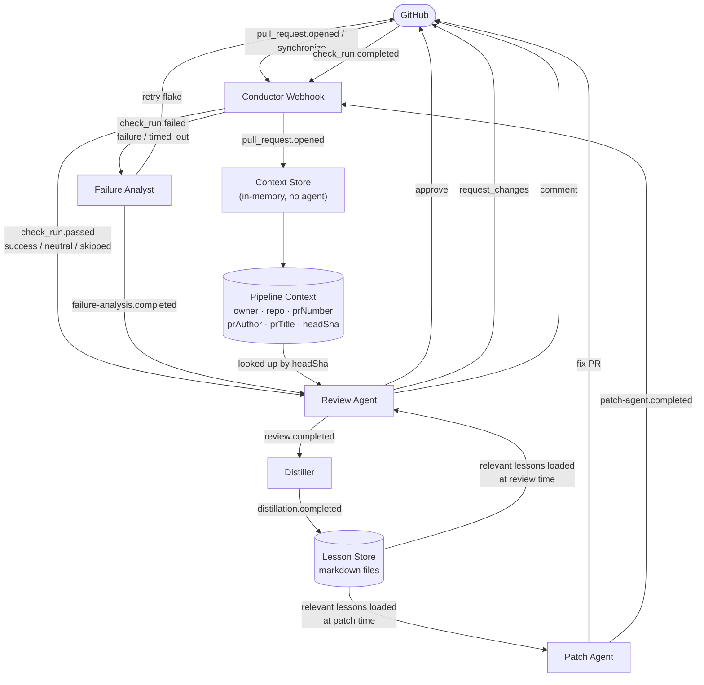
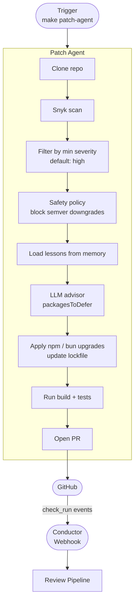

# Architecture

A multi-agent CI/CD platform where autonomous agents monitor, diagnose, fix, review, and learn from pipeline events in a continuous feedback loop.

---

## Pipeline Overview

There are two independent pipelines: one triggered by GitHub webhooks (the **review pipeline**) and one triggered on-demand (the **patch pipeline**).

---

## Review Pipeline

Triggered by GitHub webhooks. Runs on every PR push and CI check completion.



### Event flow

| Incoming event | Source | Routes to |
|---|---|---|
| `pull_request.opened` | GitHub webhook | Context Store (no agent, stores PR metadata) |
| `check_run.passed` | GitHub webhook | Review Agent directly |
| `check_run.failed` | GitHub webhook | Failure Analyst |
| `failure-analysis.completed` | Failure Analyst | Review Agent |
| `review.completed` | Review Agent | Distiller |
| `distillation.completed` | Distiller | _(terminal)_ |

### Correlation IDs

All events for the same PR share `${owner}/${repo}:${headSha}`. This lets the
conductor stitch context across pipeline stages without a database — the PR
metadata stored when `pull_request.opened` fires is retrieved by headSha when
`check_run.passed` arrives later.

---

## Patch Pipeline

Triggered on-demand (CLI / cron / future scheduler). Runs independently of the
review pipeline and feeds into it by opening a PR.



### Patch agent decision layers

There are three layers of filtering before any package is upgraded:

1. **Severity filter** — only actionable if `>= minSeverity` (default: `high`). Configured per-run.
2. **Safety policy** — deterministic, domain-layer. Blocks semver downgrades (e.g. `3.0.0 → 2.9.1`) with no LLM involved.
3. **LLM advisor** — reads lessons from memory and returns `packagesToDefer: string[]`. Only defers when lessons document past failures with that package; does not defer on major-version jumps alone.

---

## Components

### Conductor (`apps/conductor/`)

The orchestration hub. It has no domain logic of its own — it wires the other agents together.

**Responsibilities:**
- Receives GitHub webhooks (Hono HTTP server, `@octokit/webhooks` signature validation)
- Emits `PipelineEvent`s onto the internal event bus (`OrchestratorPort`)
- Routes events to agent use-cases via `RouteEvent` + `AgentDispatcher`
- Accumulates pipeline context across stages in a `Map<correlationId, PipelineContext>` (including failure decisions for advisory mode)
- Exposes an HTTP API for the UI (`POST /api/runs`, `GET /api/runs/:id/stream` SSE, `GET/PUT /api/memory/:repo`)

**Key files:**
```
apps/conductor/src/
  main.ts                                  ← wires everything; AgentDispatcher fn
  domain/policies/routing-policy.ts        ← event → agent mapping
  domain/policies/review-mode-policy.ts    ← FailureDecision[] → advisory/full mode
  application/use-cases/
    handle-webhook.ts                      ← splits check_run into passed/failed
    route-event.ts                         ← subscribes to events, calls dispatch
    handle-agent-completion.ts             ← error path; emits pipeline.failed
  adapters/http/
    webhook.server.ts                      ← Hono + @octokit/webhooks
    api.server.ts                          ← UI API endpoints + SSE log streaming
```

**Swappable:** The `OrchestratorPort` (`emit`, `on`, `off`) is designed for a clean swap to **Inngest** or any other durable event bus with no domain changes.

---

### Failure Analyst (`agents/failure-analyst/`)

Classifies CI check run failures and routes them to the right action.

**Decision matrix:**

| Classification | Action |
|---|---|
| `infra-flake` | Retry CI (tracked per-check, up to `maxRetries`) |
| `code-bug` | Escalate / notify (future: trigger fixer agent) |
| `unknown` | Escalate |
| Retry limit reached | Escalate regardless of category |

**Classification approach:**
1. **Heuristic hint** — 4 regex patterns for unambiguous infra signals (`ETIMEDOUT/ECONNRESET/ECONNREFUSED`, `rate limit`, `socket hang up`, `ENOMEM`). If matched, the result is injected into the LLM prompt as a suggestion the LLM can confirm or override.
2. **LLM always runs** — `ClassifierLlmPort` is called for every failed check with the full context: check output, annotations, logs, PR title, PR body, and the optional hint. Results below 60% confidence are downgraded to `unknown`.

The LLM bypassed-by-heuristic approach was dropped because patterns like `timeout` are ambiguous — a performance regression looks identical to an infra flake at the regex level. Giving the LLM the hint as context (rather than as a hard answer) keeps the speed benefit for obvious cases without locking in wrong classifications.

**Emits:** `failure-analysis.completed` with `analyses[]` (category, decision, failure signature per check run).

**Key files:**
```
agents/failure-analyst/src/
  domain/policies/
    classification-policy.ts    ← heuristics + confidence thresholds
    retry-policy.ts             ← shouldEscalateRetry()
  adapters/
    llm/copilot-classifier.adapter.ts
    state/in-memory-retry-tracker.ts
  application/use-cases/analyze-failure.ts
```

---

### Review Agent (`agents/review-agent/`)

Scores a PR against a dynamic checklist and posts a GitHub review.

**Scoring model:**
- Each checklist item scored 0–100 by LLM
- Weighted average → overall score
- Thresholds: approve ≥ 80, request_changes ≤ 40, comment in between
- **Advisory mode**: when the conductor detects a genuine CI failure (`route_to_fixer` or `escalate`), the decision is forced to `request_changes` regardless of score. A banner is prepended to the GitHub comment. Code quality feedback is still provided.

**Checklist selection:**
- Checklist is selected dynamically by `getChecklist(prAuthor, prTitle)` in the conductor
- Patch-agent PRs (`prAuthor = "chore-bot"`) get the security patch checklist
- Other bots get a bot-PR checklist; humans get a general checklist

**Lesson context:**
- Loads relevant lessons from the lesson store filtered by repo + task type
- Loads past reviews of the same task type
- Both are injected into the LLM prompt to inform scoring

**Emits:** `review.completed` with `{ prNumber, result: { overallScore, decision, checklistScores, mode, advisoryReason? } }`.

**Key files:**
```
agents/review-agent/src/
  domain/policies/
    review-policy.ts            ← calculateOverallScore(), makeReviewDecision()
  application/use-cases/evaluate-pr.ts
  adapters/
    llm/copilot-reviewer.adapter.ts
    memory/in-memory-knowledge.adapter.ts
```

---

### Distiller (`agents/distiller/`)

Extracts structured lessons from a completed pipeline run and persists them to the lesson store for future agents to use.

**Input:** A `PipelineSummary` containing the PR diff, failure signatures, review score, review decision, and review feedback.

**Output:** 1–5 `Lesson` objects, each with: `problem`, `solution`, `context`, `outcome`. Stored as markdown files with stable hash-based IDs (same input → same ID → overwrites stale lesson).

**Quality filters (domain layer, no LLM):**
- `meetsQualityThreshold()` — rejects lessons with empty problem/solution
- `deduplicateLessons()` — removes near-duplicate lessons within the same run
- Consolidator LLM pass — merges the new lesson with existing lessons for the same repo to avoid unbounded growth

**Focus policy:**
- `getDistillationFocus(prAuthor, prTitle)` injects extra instructions into the LLM prompt
- Patch-agent PRs focus on: what was upgraded, what was deferred, why

**Emits:** `distillation.completed` (terminal event).

**Key files:**
```
agents/distiller/src/
  domain/policies/
    quality-policy.ts           ← meetsQualityThreshold(), deduplicateLessons()
    summarization-policy.ts
  application/use-cases/distill-lessons.ts
  adapters/llm/
    copilot-summarizer.adapter.ts
    copilot-consolidator.adapter.ts
```

---

### Patch Agent (`agents/patch-agent/`)

Autonomous security patching. Scans a repo for vulnerabilities with Snyk, applies safe upgrades, validates with build + tests, and opens a PR.

**Full flow:**
1. Clone repo to temp dir (discarded after run)
2. Generate `package-lock.json` if only `bun.lock` exists (Snyk compatibility)
3. Snyk scan (`--all-projects --json`)
4. Filter by `minSeverity` (default: `high`)
5. Safety policy: drop semver downgrades
6. Load lessons from memory (namespace: `security-patch`)
7. LLM advisor: `packagesToDefer` — packages too risky to auto-apply this run
8. `applyPackageFixes()` — updates `package.json` + regenerates lockfile
9. `runChecks()` — build + test validation
10. Commit + push + open PR
11. Emit `patch-agent.completed` to conductor

**Key files:**
```
agents/patch-agent/src/
  domain/
    entities/patch-plan.ts          ← PatchPlan, SkippedFix, PatchResult
    entities/vulnerability.ts
    policies/
      severity-policy.ts            ← filterByMinSeverity()
      safety-policy.ts              ← filterSafeUpgrades() (no LLM)
      grouping-policy.ts            ← buildPatchPlan(), buildPrTitle()
    utils/format-pr-body.ts
  application/
    ports/patch-advisor-llm.port.ts ← PatchAdvice { packagesToDefer }
    use-cases/patch-vulnerabilities.ts
  adapters/
    snyk/snyk-cli.adapter.ts        ← wraps snyk CLI
    git/shell-git.adapter.ts        ← clone, branch, apply, commit, push
    llm/copilot-patch-advisor.adapter.ts
```

---

## Shared Package (`packages/shared/`)

All agents are written against interfaces in `@tilsley/shared`. A new agent imports types and ports from here on day one — no coupling to other agents.

**Key exports:**

| Category | Exports |
|---|---|
| Entities | `PullRequest`, `CheckRun`, `FailureSignature`, `ReviewChecklist`, `Lesson`, `PipelineContext` |
| Ports | `GitHubPort`, `ChatCompletionPort`, `MemoryPort`, `EventBufferPort` |
| Events | `PipelineEvent`, `AgentTask`, `AgentResult` |
| Utils | `Result<T,E>`, `truncateLog()` |

---

## Architecture Principles

Every agent follows **Clean Architecture**:

```
Adapter layer   ← LLM adapters, GitHub client, Snyk CLI, git shell
     ↓
Application layer  ← use-cases (orchestrate), port interfaces (define contracts)
     ↓
Domain layer    ← entities, policies, value objects (pure TypeScript, no deps)
```

**Dependencies always point inward.** The domain never imports from adapters.

**Agents are policy-driven decision engines with unreliable advisors (LLMs).** The LLM is just one adapter behind a port — it can be mocked, replaced, or bypassed. Deterministic policies (heuristics, semver checks, quality filters) run first and are never delegated to the LLM.

---

## Replicating This Architecture

To implement a similar system:

1. **Define your event types** in a shared package. Events are the contract between agents — nail these first.
2. **One use-case per agent action.** `AnalyzeFailure`, `EvaluatePr`, `DistillLessons`, `PatchVulnerabilities` — each is a plain class with typed input/output.
3. **Ports for everything external.** LLM, GitHub, storage, git — all behind interfaces. This is what makes tests fast and adapters swappable.
4. **The conductor is just a router.** It maps event types to agent use-cases and threads context across stages. Its only decision logic is the `deriveReviewMode` policy, which reads failure-analyst decisions and tells the review agent whether to run in advisory mode.
5. **Deterministic policies as hints, not gatekeepers.** Severity filters and semver checks are hard rules (domain layer, no LLM). Regex heuristics are hints — pass them to the LLM as context rather than bypassing the LLM entirely. A pattern like `timeout` looks the same whether it's infra or a performance regression you just introduced; the LLM has the PR diff and title to tell them apart.
6. **Lessons are facts, not chat history.** The distiller extracts structured `{ problem, solution, context, outcome }` facts. These are injected into future agent prompts as grounded context.

### Folder structure per agent

```
agents/my-agent/
  src/
    domain/
      entities/          ← data shapes (no methods that hit external systems)
      policies/          ← pure functions (filtering, scoring, decision logic)
      utils/             ← formatters, mappers
    application/
      ports/             ← interfaces (LlmPort, StoragePort, ConductorPort)
      use-cases/         ← one file per top-level action
    adapters/
      llm/               ← implements LlmPort
      github/            ← implements GitHubPort
      ...
  test/
    domain/              ← unit tests (no mocks needed)
    use-cases/           ← mocked ports
    adapters/            ← integration tests (optional)
```
